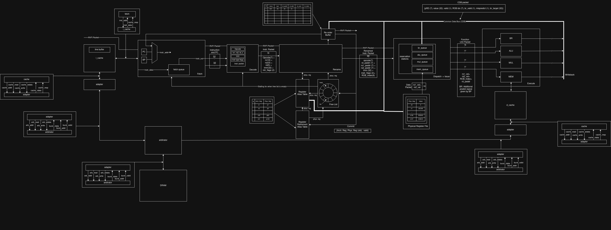

## Block Diagram

Figure: High-level block diagram of the out-of-order core and its interfaces.

This diagram shows the major functional blocks and how they connect:

- Fetch: instruction fetch and basic decode logic that feeds the pipeline.
- Decode: decodes instructions into opcode, operand register, immediate value, and .
- Rename: maps architectural registers to physical registers for out-of-order execution.
- Dispatch: sends renamed instructions to the reservation stations.
- Reservation Stations: holds decoded iunstructions and their operand status until they are ready to issue. After operands are ready, instructions are issued to execution units.
- Execution units: ALUs, memory access units and other functional units that perform operations.
- Reorder Buffer (ROB): tracks instruction order, retirement, handles branch misprediction, and commit.
